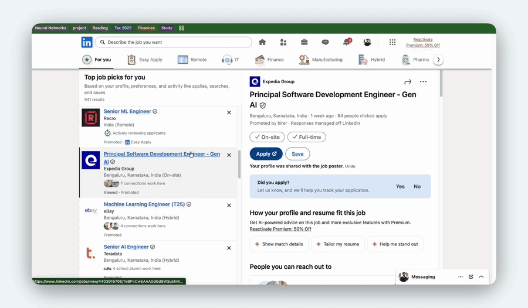

# Where did I apply?

  

Where did I apply? is an unreleased Chrome extension for tracking job applications while you browse. It detects supported job pages, captures useful application details, and keeps a local list of saved jobs that you can revisit from the extension popup.

## Local Chrome Setup

Because this extension is not published in the Chrome Web Store yet, install it locally as an unpacked extension.

1. Download or clone this repository to your computer.
2. Open Chrome and go to `chrome://extensions`.
3. Turn on **Developer mode** in the top-right corner.
4. Click **Load unpacked**.
5. Select this repository folder, the folder that contains `manifest.json`.
6. Pin **Where did I apply?** from the Chrome extensions menu if you want quick access from the toolbar.

The extension should now run locally in Chrome. Open a supported job posting or application page, then click the extension icon to review or save detected application details.

## Updating Your Local Copy

When you change files in this repository or pull a newer version:

1. Go back to `chrome://extensions`.
2. Find **Where did I apply?**.
3. Click the reload icon on the extension card.
4. Refresh any open job pages so the updated content scripts can run.

## Supported Sites

The extension includes extractors for several application platforms and career sites, including:

- Amazon Jobs
- Ericsson
- Google Careers
- Greenhouse
- Lever
- LinkedIn
- RippleHire
- SAP
- Workday

It also includes a generic extractor for pages that do not match one of the dedicated integrations.

## Local Data

Saved application data is stored locally through Chrome extension storage. Since this is a local, unreleased installation, your saved jobs stay tied to the Chrome profile where you loaded the extension.

If you remove the extension from Chrome, Chrome may also remove its stored extension data. Export or copy anything important before uninstalling.

## Troubleshooting

- If the extension does not appear, confirm you selected the repository folder that contains `manifest.json`.
- If changes are not showing up, reload the extension from `chrome://extensions` and refresh the job page.
- If a site is not detected correctly, the generic extractor may still capture partial details, but dedicated support may need to be added for that site.
